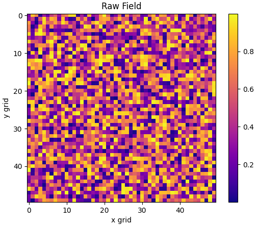
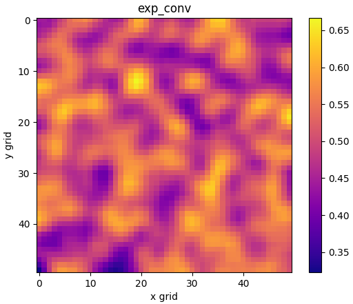
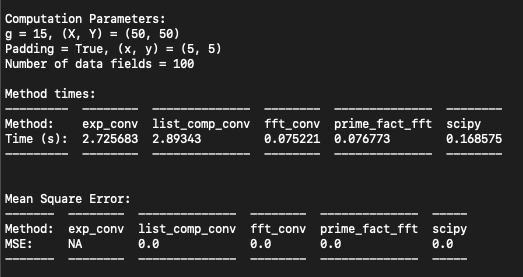
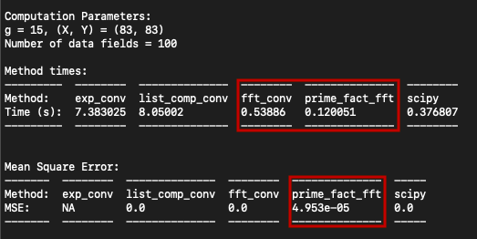
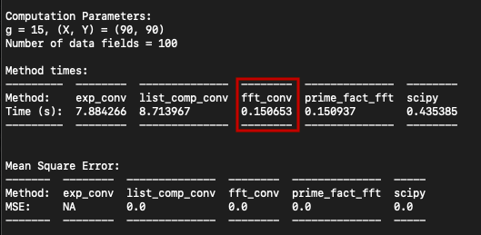

# Python Convolution Test

## Introduction

This document outlines a simple convolution algorithm test performed in Python. The methods outlined below are some common implementations of convolution algorithms. Some are practical methods one might use in scientific computing such as `scipy`'s `signal.convolve2d()`. Others are not, such as the explicitly coded convolution algorithms. The algorithms are implemented for practical use in that they can handle padded data, similar to something you might find while working with scientific images.

The point of this work is to illustrate some advantages and disadvantages of using these methods and to show that the details of a specific problem can change the method's efficiency. This work is not a deep dive into the inner workings of the algorithms. No 'Big O' complexity calculations are done here. We simply want to gain some evidence on the workings of practical convolution calculations one might encounter in common data analysis applications.

## Method

Convolution algorithms have a variety of applications. Although there are many methods to speed up these calculations, with sufficient volumes of data, computational time can still be non-negatable, especially on personal computers.

One such application is in filtering images. With a 2D image, $A(x,y)$, normalized filter kernel $G(x,y)$, the convolution of $A$ with $G$ is given by

$$A \ast G(x,y) =  \int_{0}^{y} \int_{0}^{x} A(\tau, \mu)G(x - \tau, y - \mu) \,d\tau d\mu$$

An explicit way of computing this convolution is to extract an element from $A$, $a_{ij}$, along with its neighbours so that the extracted region has the same dimensions as $G$. Call the extracted region $A_{s,ij}$. Then multiply $A_{s,ij}$ with $G$ and sum all elements of the product. This becomes the value of the convolution at the point $a_{ij}$, and needs to be repeated for all points in $A$. This method is very computationally expensive and not used in practice. Instead, methods like fast Fourier transforms are used, which will be discussed later.

Filtering images has the visual effect of blurring them, as seen in the figure below. It can also be used to extract signals that are oversaturated with noise or smaller scale behaviour. Notice the blobs that emerge in the filtered field as compared to the raw field. This is a larger scale signal hidden in the random field.

Raw | Filtered
:-------------------------:|:-------------------------:
 | 

### Convolution Methods:

The following subsections briefly outline the convolution methods implemented in the `convolution` class. For more details on each method, read the docstrings or the code itself.

##### Explicit Convolution (Label:`'exp_conv'`, Method: `exp_conv()`)

This method explicitly computes the convolution using a double `for` loop.

##### Explicit Convolution using list comprehension (Label: `'list_comp_conv'`, Method: `list_comp_conv()`)

Similar to the `exp_conv` method, this method calculates the explicit convolution only using Python's list comprehension. Initially this may seem like a more Pythonic way of coding this problem but as we shall see this method produces code that is almost unreadable and offers no advantage over the double `for` loop method (`exp_conv`).

##### Fast Fourier Transform (Label: `'fft_conv'`, Method: `fft_conv()`)

This method calculates the convolution using a fast Fourier transform. This method is known to be much faster than explicit convolution algorithms.

##### Prime Factor Fast Fourier Transform (Label: `'prime_fact_fft'`, Method: `prime_fact_fft()`)

In certain cases, when the side length of the data field plus the filter width is a prime number, numpy's fast Fourier transform method slows down significantly. This is because the fft algorithm has a harder time breaking up the direct Fourier transform matrix into smaller matrices. By slightly changing the size of the data field it is possible to regain the speed at the cost of accuracy.

##### Scipy's signal.convolve2d() (Label: `'scipy'`, Method: `scipy_pad_convolve()`)

This method uses scipy's `convolution2d()` algorithm. This is a very fast and flexible method that requires minimal coding to implement.

The methods above will be tested for special cases. Usually, the edges of a filtered image would be trimmed by $1/2$ the filter width because there simply isn't data outside the image to compute these values. Because the data fields tested here are filled with randomly generated numbers from [0, 1), the methods in the `convolution` class exploit the symmetries of the data fields and wrap the edges. This produces filtered fields that are the same dimensions as the input data fields.

### Evaluation Metrics:

The convolution algorithms will be evaluated using two performance parameters, computational time and accuracy.

To evaluate the time, the methods will be timed using Python's `time` module. It is important to note that practical computational time is system specific. The values used here are meant as an estimate to guide timing factors. Investigating true algorithm efficiency and complexity are outside of the scope of this study.
 
To evaluate accuracy, the explicit convolution method (`exp_conv`) will be taken as the control because it does not rely on other complex modules. The convolved fields produced by each method will be compared to the control using the Mean Square Error (MSE) computed over each point of each data field. The MSE is given by

$$ MSE = \frac{1}{n} \sum_{i=1}^{n} (X_i - \hat{X}_i)^2 $$

where $n$ is the total number of samples from all data fields, $X_i$ are the samples from the control, and $\hat{X_i}$ are the samples from the method that is being tested.

## Results

#### Speed Test:

The speed test was run using 100 data fields of 50x50 grid points (gp) filled with random numbers from [0, 1) generated by `numpy.random.rand()`. Each field is padded with 5gp of `np.nan` on each side. A Gaussian filter kernel of 15gp x 15gp was convolved with each data field. The table below shows the results of the calculation.

Not surprisingly, the two explicit convolution methods are much slower than the Fourier transform methods, being about 36 times slower than `fft_conv`. For the `list_comp_conv` method, not only is it almost impossible to read, it's slower than the `exp_conv` method, giving more reason not to write complex list comprehension statements.

The two fast Fourier transform methods, `fft_conv` and `prime_fact_fft` are faster than `scipy` by about a factor of 2. This is because these two methods are written specifically for computing this problem, whereas `scipy`'s `convolution2d()` method is built to be more flexible. This result illustrates an interesting point, which is, although Python modules contain powerful and easy to implement methods, sometimes building a custom tool to solve a specific problem can improve performance, in this case by cutting the computation time in half.

#### Prime Factor fft:

One interesting result is the performance of the `fft_conv` method when the side length of the data field plus the side length of the filter kernel domain is prime. In this case we pick `(X, Y) = (83, 83)` and the filter width, `g = 15`. The `convolution` class uses `int(g/2)` to pad the data field given to the `fft` method. This produces an array with side lengths equal to `(Y + 2*int(g/2), X + 2*int(g/2)) = (97, 97)`, which are prime numbers.

In this case, the `fft_conv` method slows down to a point where the `scipy` method becomes faster. On the other hand, the `prime_factor_fft` method retains its speed, being about three times as fast as `scipy`. The cost of this speed up is accuracy. The accuracy is shown by the Mean Square Error (MSE) between the `prime_factor_fft` convolved field and the result given by `exp_conv`. The MSE is about 5e-5. Although this may seem like a small difference, in cases where the precision of the convolution is important, this method should not be used. However, in applications where the accuracy is not important, such as blurring a very large set of images, this method can greatly speed up a calculation as the error would be unnoticeable to human eyes.

To illustrate the speed difference further, we can increase the size of the data field, making sure that the side lengths are not prime. We can take `(X, Y) = (90, 90)` with the same filter kernel (`g = 15`), producing `(Y + 2*int(g/2), X + 2*int(g/2)) = (104, 104)`.

For the `fft_conv` method, by increasing the domain size we have sped up the computation. When the domain size was prime, `fft_conv` took `0.5s`. By increasing the size of the domain by seven grid points in each direction (121,100 grid points in total!), the speed decreased to `0.15s`, a factor of three faster.

## Conclution

Out of the methods tested here, the `prime_factor_fft` method produced the fastest computation time although it introduced a small error in the result. The `scipy` method produced low computation times over all the parameter ranges tested, although wasn't as fast as the fft methods for specific cases. 

What this short study illustrates is that because small improvements to convolution algorithms produce large changes in efficiency, case specific adjustments to the implementation of these algorithms can produce noticeable and practical speed ups. If you're on tight computational margins, it is worth evaluating the implementation of the convolution method, as small changes can speed up computations by a factor of two or three.
